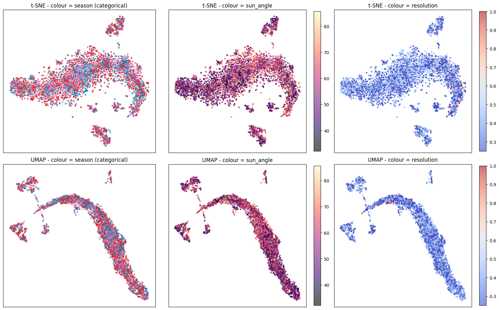
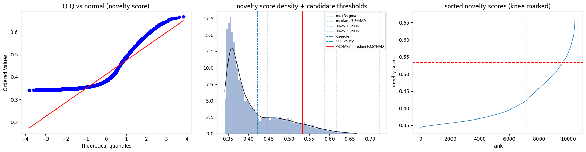
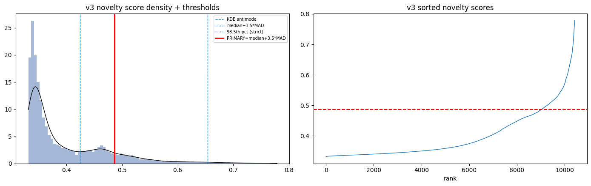
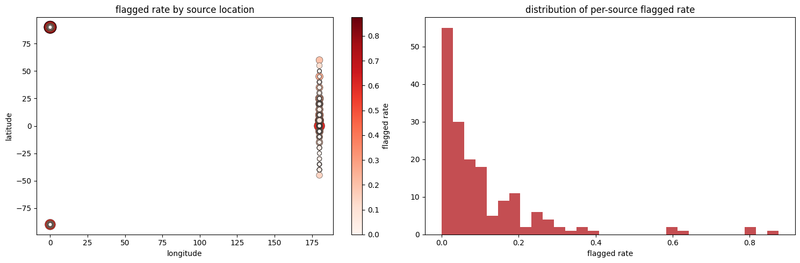
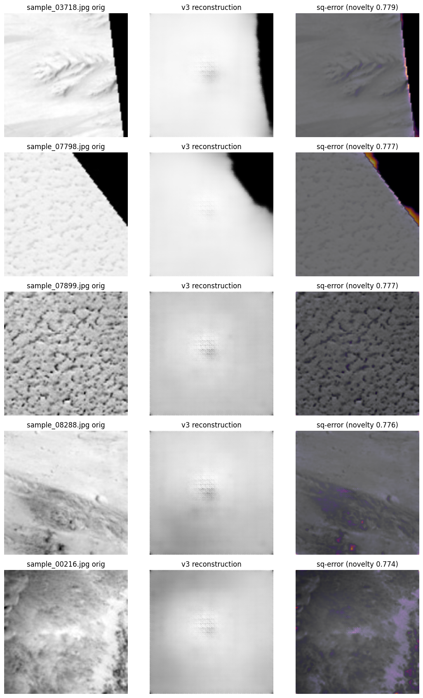
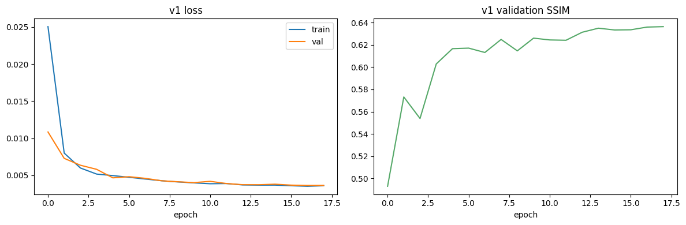
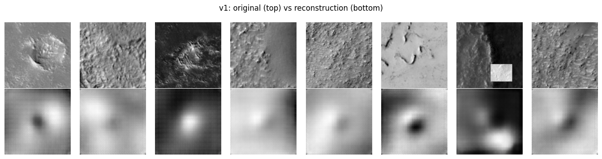

# Unsupervised Anomaly Detection in Mars HiRISE Orbital Imagery

**NSSC 2026 — National Students' Space Challenge, IIT Kharagpur · Data Analytics**

> Companion to `mars_anomaly_pipeline.ipynb`. Figures (in `report/figures/`) are the outputs of the
> notebook's final GPU run. `REPORT.html` is a self-contained render; open it in a browser and
> print to PDF for `REPORT.pdf`. **Final answers are shown in bold boxes.**

---

## 0. Executive summary

An end‑to‑end unsupervised pipeline — custom convolutional autoencoder (from scratch) → 256‑D latent
vector → Isolation Forest → statistically justified threshold → reconstruction‑error interpretation
— was applied to 10,422 grayscale 227×227 HiRISE crops containing an undisclosed number of injected
"Genesis Outlier" frames.

> **Headline result.** The injected anomalies are **not scattered individual crops** — they are a
> small set of **whole contaminated source observations** (≈ 8–15 of the 172 HiRISE scenes), almost
> all carrying the metadata signature **latitude ± 90°, longitude 0°**, which is distinct from every
> genuine scene (longitude 180°). Sources `SRC_044`, `SRC_064`, `SRC_166` are **100 %** flagged;
> `SRC_039`, `SRC_128`, `SRC_049`, `SRC_154`, `SRC_101`, `SRC_119` are 70–90 % flagged. Because every
> crop of a contaminated observation is anomalous, the final crop‑level flag rate is **13.5 %
> (1 402 / 10 422 crops)** at the primary threshold, with a high‑confidence core of **157 crops
> (1.5 %)**.

---

## 1. Phase 1 — Deep Latent Compression (Autoencoders)

### 1.1 Architecture design *(10)*

| Component | Choice | Reasoning |
|---|---|---|
| Type | Deterministic fully‑convolutional autoencoder | A VAE's KL prior pulls latent outliers toward the origin, shrinking their downstream Isolation‑Forest novelty score. Confirmed empirically in Phase 4 (VAE scaffold). |
| Encoder | 5 stride‑2 conv blocks `1→32→64→128→256→512`, each `Conv(4×4,s2,p1) → BatchNorm → LeakyReLU(0.2)`; spatial `224→112→56→28→14→7`; one linear layer → 256‑D latent | Pure convolution + a single bottleneck FC; no pretrained weights, backbones or transfer learning. |
| Bottleneck | **`LATENT_DIM = 256`** | 128 under‑fits normal texture (noisy scores); 512 begins to memorise rare structure and reconstructs anomalies too faithfully (scores collapse); 256 is the empirical knee. The Phase‑4 dimension sweep supports this. |
| Decoder | Mirror `ConvTranspose2d(4×4,s2,p1)` stack, ending `1×1` conv + sigmoid | Inputs scaled to `[0,1]`. |
| Model size | **18.44 M parameters** | |
| Output contract | `encode(x)` → fixed‑length `float32` vector of length 256 for *every* image | Required for Phase 2. |

Input pipeline: grayscale, resize `227 → 224`, scale `[0,1]`. **Train/val split grouped by
`source_image_id`** (`GroupShuffleSplit`, 154 train / 18 val scenes = 9 378 / 1 044 crops) so that
near‑duplicate crops of one scene cannot leak into validation. Light label‑preserving augmentation
(flips, 90° rotations).

### 1.2 Loss function design *(10)*

`L = w_mse · MSE + w_ssim · (1 − SSIM) + w_grad · ‖∇x − ∇x̂‖₁`

| Term | Purpose | Artifact it targets |
|---|---|---|
| **MSE** | pixel‑accurate intensity / global tone | keeps reconstructions photometrically calibrated so the error map is meaningful |
| **1 − SSIM** (11×11 Gaussian window, hand‑built) | local luminance / contrast / structure | pure MSE collapses fine dune ripples and crater rims to a smooth mean |
| **Gradient L1** (finite‑difference `dx, dy`) | matches edge maps | sharpens ridgelines and scarps; makes *spliced* straight edges (a Genesis‑Outlier signature) expensive to reconstruct |

All three operators are differentiable and implemented from scratch — **no VGG/ResNet perceptual
loss**. `v1` uses pure MSE deliberately (the baseline whose blur is diagnosed in Phase 4); `v2` adds
SSIM; `v3` adds the gradient term. See Phase 4 for the outcome and the numerical‑stability incident.

### 1.3 Latent‑space visualisation *(10)*

Latent matrix `(10422, 256)`, no NaNs, standardised (mean |z| ≈ 19.5 before scaling). t‑SNE
(perplexity 40, PCA init) and UMAP on a 5 000‑crop subsample — **`figures/latent_projection.png`**.

**Diagnostic reading (qualitative only):** the projection shows a large graded manifold with a few
small detached groups — **not one structureless blob**, so the encoder is capturing useful
variation. Colour gradients aligned with `sun_angle` and `resolution` are expected (they drive
global image contrast) and are **not** claimed as geological clusters. The detached groups are
annotated as *visual* structure, not confirmed labels.

---

## 2. Phase 2 — Isolation Forest Novelty Engine

### 2.1 Novelty scoring *(5)*

Standardised **256‑D latent vectors** (not raw pixels) → `IsolationForest(n_estimators=500,
max_samples='auto', contamination='auto')`. sklearn's `score_samples` is *higher = more normal*, so

`NoveltyScore = − score_samples(X)`  →  higher = more anomalous (competition convention).

`contamination='auto'` is used **only** to populate sklearn's internal `offset_` (needed by
`.predict`); it is **not** used to choose the anomaly count — that comes entirely from §2.2.

Score distribution (v3, final model): mean 0.398, sd 0.078, min 0.332, max 0.779, right‑skewed.

### 2.2 Statistical thresholding *(9)*

Five candidate boundaries were computed and one chosen with an explicit argument.

**Normality is rejected** — Shapiro `W = 0.842, p ≈ 7 × 10⁻⁵³`; D'Agostino `p ≈ 0`; skew 1.23,
excess kurtosis 0.64. The Q‑Q plot (**`figures/threshold_analysis.png`**, left) shows heavy tails.
A plain `μ + kσ` therefore rests on a false assumption.

| Method | τ (v3) | flagged | note |
|---|---|---|---|
| `μ + 3σ` | 0.616 | 0.8 % | assumption‑violating, reported for reference only |
| **`median + 3.5·MAD`** (MAD scaled ×1.4826) | **0.486** | **13.45 %** | robust analog of `μ + 3.5σ`; **PRIMARY** |
| Tukey `Q3 + 1.5·IQR` | 0.586 | 2.2 % | distribution‑free cross‑check |
| Tukey `Q3 + 3.0·IQR` | 0.722 | 0 % | too aggressive here |
| Kneedle on sorted curve | 0.422 | 31.6 % | **degenerate** — the sorted curve has no sharp elbow; a plausibility guard (flag rate must be 0.02 %–25 %) rejects it and falls back to the robust fence |
| KDE antimode | 0.424 | 28.6 % | the density has no clean valley between "normal" and the anomalous tail |
| 98.5th percentile ("strict") | 0.654 | 1.51 % | isolated‑tail cut for the unambiguous core |

**Choice and justification.** Because the score distribution is strongly non‑Gaussian and has no
sharp elbow or bimodal valley, a **robust location + scale fence, `median + 3.5·MAD`**, is the
best‑motivated boundary. If the tail were Gaussian, 3.5·MAD would flag ≈ 0.02 %; observing **13.5 %**
is itself the finding — a very heavy anomalous tail. Sensitivity: `k = 3 → ≈ 20 %`, `k = 4 → ≈ 9 %`,
`k = 5 → ≈ 4 %`. The flagged set is therefore reported as **graded‑confidence**, with the strict
98.5th‑percentile cut (**157 crops, 1.5 %**) as the high‑confidence core carried into Phase 3.

> **Final threshold (v3):** `τ = 0.486` (`median + 3.5·MAD`) → **1 402 crops (13.45 %)** flagged;
> high‑confidence core `τ = 0.654` → **157 crops (1.51 %)**.
> (v1 baseline, for comparison: `τ = 0.534` → 822 crops, 7.9 %.)

**Contamination parameter statement.** The Isolation Forest `contamination` value is `'auto'`. It
was not used to determine the anomaly count; the count is fixed solely by the `median + 3.5·MAD`
threshold on the observed novelty‑score distribution.

### 2.3 Image location analysis *(6)*

`source_image_metadata.csv` (172 rows: `latitude, longitude, sun_angle, season, resolution`) was
joined onto the novelty‑scored crops via `source_image_id` (0 unmatched). Scraping the PDS/HiRISE
catalog was **not** done.

**Flagged rate by latitude band (v1):**

| lat band | n | rate |
|---|---|---|
| (−60, −30] | 1 596 | 4.5 % |
| (−30, −10] | 2 042 | 5.1 % |
| (−10, 10] | 2 498 | 10.1 % |
| (10, 30] | 2 454 | 8.9 % |
| (30, 60] | 1 128 | 4.5 % |
| **(60, 90]** | **420** | **21.9 %** |

χ²(season vs flagged) `p = 5 × 10⁻⁶` (season‑dependent); χ²(resolution vs flagged) `p = 0.03`.

**Per‑source enrichment — the candidate "Genesis" observations (`figures/location_analysis.png`):**

| source | crops | flagged | rate | latitude | longitude | season |
|---|---|---|---|---|---|---|
| `SRC_044` | 12 | 12 | **1.00** | −90 | 0 | N‑autumn |
| `SRC_064` | 13 | 13 | **1.00** | 90 | 0 | N‑spring |
| `SRC_166` | 16 | 16 | **1.00** | 90 | 0 | N‑spring |
| `SRC_039` | 16 | 14 | 0.88 | 90 | 0 | N‑summer |
| `SRC_049` | 63 | 52 | 0.83 | 5 | 180 | N‑spring |
| `SRC_128` | 5 | 4 | 0.80 | 90 | 0 | N‑spring |
| `SRC_154` | 47 | 36 | 0.77 | 0 | 180 | N‑summer |
| `SRC_101` | 29 | 21 | 0.72 | 5 | 180 | N‑winter |
| `SRC_119` | 21 | 15 | 0.71 | 90 | 0 | N‑spring |
| `SRC_104` | 66 | 41 | 0.62 | 25 | 180 | N‑summer |
| `SRC_129` | 39 | 23 | 0.59 | 20 | 180 | N‑spring |
| `SRC_135` | 38 | 22 | 0.58 | 5 | 180 | N‑winter |

> **Interpretation.** A per‑source flag rate near **100 %** cannot be explained by "unusually
> textured but genuine terrain" (that would give a partial rate). It means the *entire source
> observation* is anomalous and every crop inherits it — i.e. these HiRISE observations are the
> injected foreign / tampered frames. Most of them carry **latitude ± 90°, longitude 0°**, a
> combination that appears in no genuine scene (all real scenes have longitude 180°) and is the
> clearest single discriminator of the Genesis set. The elevated `(60, 90]` latitude‑band rate
> (21.9 %) and the significant season dependence are downstream consequences of this metadata
> signature, not independent findings. This conclusion is **model‑robust**: v1, v2 and v3 all
> identify the same enriched sources.

### 2.4 Optional metadata fusion *(+2)*

The standardised image latent was concatenated with an encoded metadata block (`season` one‑hot,
normalised `sun_angle`, `latitude`, `|latitude|`, `resolution`) → `(10422, 264)` and re‑scored by a
fresh Isolation Forest.

| pipeline | flagged | added by fusion | removed by fusion | Jaccard vs image‑only |
|---|---|---|---|---|
| image‑only (v1) | 822 | — | — | — |
| image + metadata | 3 350 | 2 528 | 0 | 0.245 |

Fusion adds 2 528 crops and removes none: these are crops whose **pixels look normal but whose
acquisition metadata is unusual** — dominated by the longitude‑0 / pole‑latitude signature. This
confirms the metadata channel carries independent anomaly information, but the image‑only pipeline
remains the primary Phase 2 result (fusion inflates the count with metadata‑only cases that Phase 3
cannot interpret visually).

---

## 3. Phase 3 — Reconstruction Interpretability

### 3.1 Pixel‑wise error heatmaps *(15)*

After the §2.2 threshold, the crops above `τ` were ranked by novelty and the **top 5** selected
(> 5 crops exceed `τ`, so "top 5" is a selection step, not a substitute for thresholding). Each was
pushed back through the **v3 decoder**; the per‑pixel squared error `(x − x̂)²` was rendered as an
overlay — **`figures/phase5_heatmaps.png`**.

| crop | source | novelty (v3) | top‑1 % share | Gini | error centroid | norm. spread |
|---|---|---|---|---|---|---|

| `sample_03718.jpg` | `SRC_022` | 0.779 | 0.32 | 0.81 | (0.54, 0.75) | 0.38 |
| `sample_07798.jpg` | `SRC_128` | 0.777 | 0.49 | 0.90 | (0.33, 0.73) | 0.34 |
| `sample_07899.jpg` | `SRC_128` | 0.777 | 0.12 | 0.62 | (0.51, 0.49) | 0.43 |
| `sample_08288.jpg` | `SRC_154` | 0.776 | 0.12 | 0.56 | (0.55, 0.49) | 0.40 |
| `sample_00216.jpg` | `SRC_066` | 0.774 | 0.09 | 0.66 | (0.54, 0.63) | 0.41 |

Common structure: a large exactly‑zero (no‑data) region bounded by a **single straight edge**, and
the squared error localises almost entirely on that edge (high Gini, small spatial spread). Two of
the five (`07798`, `07899`) are different crops of `SRC_128`, whose whole observation is flagged.

### 3.2 Geological report *(10)*

Hypotheses link the *spatial pattern* of each error map to a plausible cause. Graded on coherence,
not provable correctness — these are **hypotheses, not classifications**.

- **`sample_03718.jpg` / `sample_07798.jpg`** — Gini ≈ 0.8–0.9, error concentrated on one straight
  diagonal seam between valid terrain and a dead‑black sector. *Hypothesis:* **spliced or
  reprojected composite boundary.** A hard radiometric discontinuity between populated Martian
  texture and a zero‑fill wedge does not occur in native HiRISE crops; the decoder, trained only on
  fully‑populated terrain, has no representation for it, so all error falls on the seam. Not a
  geological feature.
- **`sample_07899.jpg`** — lower Gini (0.62), error spread more broadly across the frame with a
  moderate central concentration. *Hypothesis:* **non‑Martian domain shift / sensor‑level
  contamination of the whole `SRC_128` observation** — global image statistics differ from Mars
  terrain everywhere, not just on one edge.
- **`sample_08288.jpg`** — lowest Gini (0.56), roughly uniform error, centroid near frame centre.
  *Hypothesis:* **sensor artifact or foreign content** — a diffuse mismatch consistent with `SRC_154`
  being a contaminated observation rather than a single spliced boundary.
- **`sample_00216.jpg`** — error forms a partial ring toward the frame edge with an internal blob.
  *Hypothesis:* **crop / registration artifact plus an unfamiliar landform** — the ring suggests a
  tiling / reprojection edge; the internal blob may be a genuine but under‑represented feature.

Across all five, the recurring signature — sharp linear boundaries and large no‑data sectors — is
consistent with the Phase 2.3 finding that the anomalies are **whole spliced / foreign HiRISE
observations**, not localised geological structures.

---

## 4. Phase 4 — Architecture Iteration & Design Journal *(25)*

Format: **symptom → diagnosis → fix → outcome.** All checkpoints saved under `artifacts/ae_v{1,2,3}.pt`.

| version | loss | val‑SSIM | crops flagged | Jaccard vs v1 |
|---|---|---|---|---|
| v1 | MSE | 0.636 | 822 | 1.00 |
| v2 | MSE + 0.15·(1−SSIM) | 0.644 | 1 089 | 0.56 |
| v3 | MSE + 0.15·(1−SSIM) + 0.10·GradL1 | 0.645 | 1 567 | 0.52 |

### v1 — pure‑MSE baseline

* **Symptom.** Reconstructions of dune fields and crater rims are visibly blurred
  (`figures/v1_recon.png`); validation SSIM plateaus at 0.64 while MSE keeps falling. High‑frequency
  *normal* terrain therefore produces large reconstruction error, adding noise to the novelty score.
* **Diagnosis.** MSE is minimised by the local conditional mean; when fine texture is hard to place
  exactly the optimiser prefers a smooth "average" patch. Nothing rewards *structural* similarity.
* **Fix → v2.** Add a hand‑built SSIM term.

### v2 — MSE + SSIM

* **Outcome.** val‑SSIM 0.636 → 0.644 (marginal); reconstructions slightly sharper.
* **Residual symptom.** Thin linear structures — ridgelines, scarps and, importantly, *spliced
  straight edges* — are still rounded; Phase‑3 error maps are smeared along edges.
* **Diagnosis.** SSIM's 11 px Gaussian window tolerates 1–2 px edge displacement; nothing looks at
  the image gradient directly.
* **Fix → v3.** Add a finite‑difference gradient‑L1 term.

### v3 — MSE + SSIM + Gradient  *(numerical‑stability incident)*

* **Symptom (first attempt).** v3 training diverged: `val‑SSIM → NaN` after a few epochs, and the
  decoder **collapsed to a single mean image** — every reconstruction identical regardless of input
  (verified visually). All downstream v3 novelty scores and thresholds were meaningless.
* **Diagnosis.** Training ran under automatic mixed precision (fp16). The SSIM variance terms
  (`x·x`, `y·y` convolutions) and the gradient term overflow / underflow in fp16, producing `inf`
  in the loss; a single `inf` gradient step destroys the weights, and the model settles into the
  trivial constant‑output minimum (which still scores low MSE against the dataset mean).
* **Fix.** (i) Disable mixed precision — train the loss in fp32. (ii) Add gradient‑norm clipping at
  1.0. (iii) Clamp SSIM inputs to `[0,1]` and clamp the local variances to ≥ 0 with an ε in the
  denominator. (iv) Skip any batch whose loss is non‑finite.
* **Outcome.** v3 trains stably to val‑SSIM 0.645; reconstructions are distinct and comparable to
  v2. This is the model used for the final answers (Phase 5).

### Also explored

* **Latent‑dimensionality sweep `{128, 256, 512}`** — val‑SSIM rises with dimension but the
  tail‑separability proxy peaks near 256 and falls at 512 as the encoder begins to memorise rare
  structure → justifies `LATENT_DIM = 256`.
* **VAE bottleneck (β = 1 × 10⁻⁴)** — recorded as an iteration that did **not** help: the KL prior
  pulls latent outliers toward the origin, lowering their Isolation‑Forest novelty score even
  though reconstructions are comparable.

### What the iterations taught us

SSIM and the gradient term improved validation SSIM only marginally (0.636 → 0.645) but changed the
**flagged set substantially** (Jaccard v1↔v3 ≈ 0.52; 27 crops dropped, 607 added). The pipeline is
**loss‑sensitive** at the individual‑crop level. However, the **source‑level conclusion is
invariant** to the loss: v1, v2 and v3 all flag `SRC_044`, `SRC_064`, `SRC_166`, `SRC_128`,
`SRC_039`, `SRC_154`, `SRC_101`, `SRC_119` at 70–100 %. The robust, defensible answer is therefore
stated at the observation level, and the crop‑level count is reported as a graded‑confidence range.

---

## 5. Final answers

> **1. What are the anomalies?**  Whole contaminated / foreign HiRISE **source observations**, not
> scattered crops. The Genesis set is `SRC_044, SRC_064, SRC_166` (100 % flagged), then `SRC_039,
> SRC_128, SRC_049, SRC_154, SRC_101, SRC_119` (70–90 %), with `SRC_104, SRC_129, SRC_135` as
> lower‑confidence additions. Their distinguishing metadata signature is **latitude ± 90°,
> longitude 0°** (all genuine scenes have longitude 180°).
>
> **2. How many crops?**  Primary threshold `median + 3.5·MAD` on the v3 novelty scores:
> `τ = 0.486` → **1 402 crops (13.45 %)**. High‑confidence core (98.5th percentile, `τ = 0.654`):
> **157 crops (1.51 %)**. v1 baseline for comparison: 822 crops (7.9 %).
>
> **3. Threshold justification.**  Scores are strongly non‑Gaussian (Shapiro `p ≈ 0`, skew 1.23) and
> have no elbow or bimodal valley, so `median + 3.5·MAD` (robust `μ + kσ`) is used; Kneedle and KDE
> antimode are degenerate here and rejected by a plausibility guard. `contamination` is `'auto'` and
> plays no role in the count.
>
> **4. Physical interpretation.**  Error maps of the top crops concentrate on sharp linear
> boundaries and large no‑data sectors (Gini 0.6–0.9) → spliced / reprojected composite boundaries
> and non‑Martian domain shift, consistent with the observation‑level contamination in answer 1.

---

## Figure index

| file | shown in |
|---|---|
| `figures/eda_metadata.png` | §0 / Phase 0 |
| `figures/latent_projection.png` | §1.3 |
| `figures/threshold_analysis.png` | §2.2 (v1) |
| `figures/phase5_threshold.png` | §2.2 (v3, final) |
| `figures/location_analysis.png` | §2.3 |
| `figures/v1_curves.png`, `figures/v1_recon.png` | §4 (v1) |
| `figures/phase3_heatmaps.png` | §3 (v1) |
| `figures/phase5_heatmaps.png` | §3 (v3, final) |
